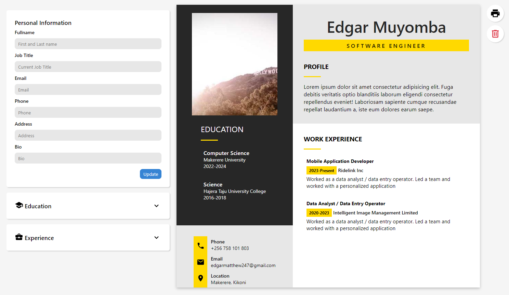
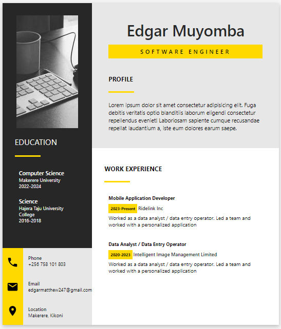
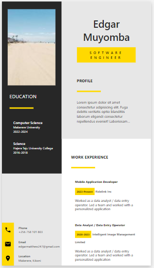

# CV Builder

This is a simple resume builder or generator as part of [The Odin Project](https://www.theodinproject.com/lessons/node-path-react-new-cv-application) react exercises. The project allows users to enter information about their bio, work and education history and uses a predefined template to generate a resume. This resume can then be downloaded at the user's convenience.

You can checkout the live demo [here](https://edgarmuyomba.github.io/cv-builder)

## Screenshots
### Desktop Preview


### Tablet Preview


### Mobile Preview


## Setting up dev
1. copy the repository [url](https://github.com/edgarmuyomba/cv-builder.git)
2. clone the repository in a desired directory
    ```
    git clone <url>
    ```
3. enter the directory using command line
4. install all the necessary dependencies using npm
   ```
   npm install
   ```
5. run this command to run the server and access the demo on [localhost:5173](http://localhost:5173/)
   ```
   npm run dev
   ```

## Build with
1. [React](https://react.dev/)
2. [react-to-print](https://www.npmjs.com/package/react-to-print)
